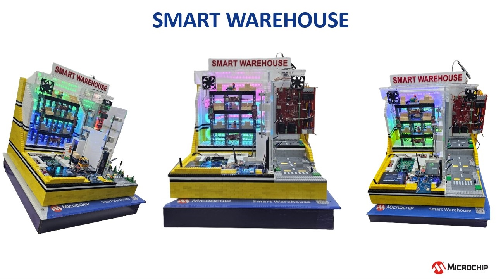
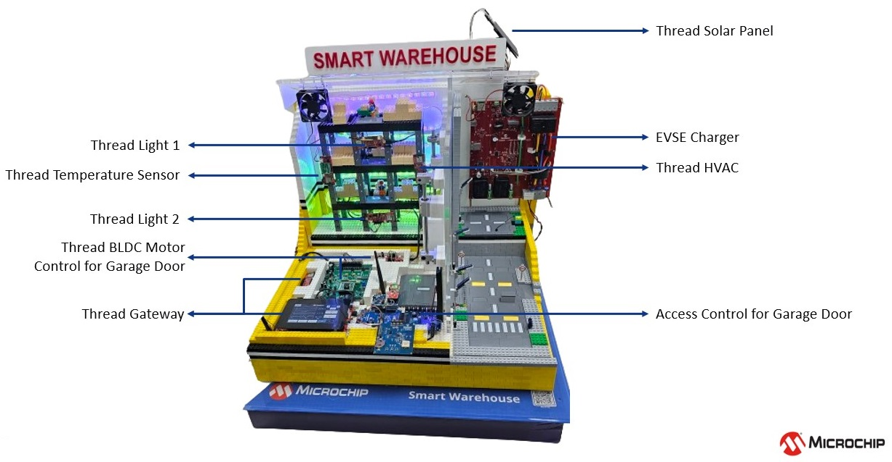
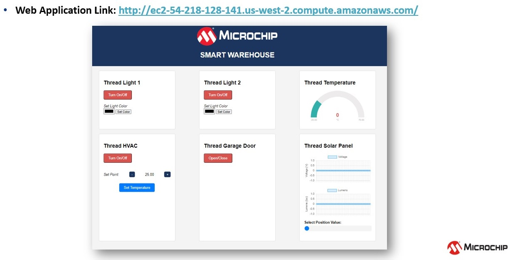

# SMART WAREHOUSE

> "IoT Made Easy!" 

Devices: **| PIC32CXBZ2 | WBZ45x | SAM9X75 |** 
Features: **| THREAD | Sub-GHz | BLE |**

## ⚠ Disclaimer

<b>
THE SOFTWARE ARE PROVIDED "AS IS" AND GIVE A PATH FOR SELF-SUPPORT AND SELF-MAINTENANCE. This repository contains example code intended to help accelerate client product development.  

For additional Microchip repos, see: <a href="https://github.com/Microchip-MPLAB-Harmony" target="_blank">https://github.com/Microchip-MPLAB-Harmony</a>

Checkout the <a href="https://microchipsupport.force.com/s/" target="_blank">Technical support portal</a> to access our knowledge base, community forums or submit support ticket requests.

</b>

## Contents

1. [Introduction](#step1)
2. [Bill of materials](#step2)
3. [Hardware Setup](#step3)

## 1. Introduction<a name="step1">

A smart warehouse leverages advanced technologies such as IoT (Internet of Things), AI (Artificial Intelligence), and automation to optimize operations and enhance efficiency. These warehouses are equipped with various sensors, cameras, and devices that collect real-time data on inventory, equipment status, and environmental conditions. AI algorithms analyze this data to optimize processes such as inventory management, picking and packing, and routing. 

However, despite the numerous benefits, smart warehouses face several challenges in their day-to-day operations. One significant challenge is the integration of diverse systems and technologies, ensuring seamless communication and interoperability among different devices and platforms. Cybersecurity is another critical concern, as the interconnected nature of smart warehouses makes them vulnerable to cyber threats. Additionally, managing and interpreting vast amounts of data generated by sensors and devices can be overwhelming, requiring robust analytics capabilities. Finally, the adoption of new technologies often necessitates substantial investments in infrastructure, training, and maintenance.

This Smart Warehouse project, Demonstrates a comprehensive smart system for a residential or commercial property. The system integrates various IoT devices, including a thermostat sensor, HVAC system, access control, lighting control, solar panels, garage door, and EV charger, all connected to a Thread gateway. Thread is a wireless communication protocol designed for IoT applications, providing reliable and secure connectivity. By integrating these devices into a unified system, you aim to enhance energy efficiency, security, and convenience for the occupants. Additionally, the integration with AWS (Amazon Web Services) enables remote monitoring and control through a web interface, enhancing accessibility and scalability. This project showcases the potential of IoT and cloud technologies to create smart and sustainable environments.

## 2. Bill of materials<a name="step2">

| TOOLS | QUANTITY |
| :- | :- |
| [PIC32CX-BZ2 and WBZ451 Curiosity Development Board](https://www.microchip.com/en-us/development-tool/EV96B94A) | 7 |
| [TEMP&HUM 13 CLICK](https://www.mikroe.com/temphum-13-click) | 1 |
| [SAM C21 XPLAINED PRO EVALUATION KIT](https://www.microchip.com/en-us/development-tool/atsamc21-xpro) | 1 |
| [ATAB-LFTX-V4.0](https://www.microchip.com/en-us/development-tool/ev72x74a) | 1 |
| [ATA5831-XPRO](https://www.microchip.com/en-us/development-tool/ev14t68a) | 1 |
| [ATAB5702A-V2.3B](https://www.microchip.com/en-us/development-tool/ev06z22a) | 1 |
| [SAM9X75 Curiosity Development Board](https://www.microchip.com/en-us/product/sam9x75) | 1 |
| [AC69T88A](https://www.microchip.com/en-us/development-tool/AC69T88A) | 1 |
| [DSPICDEM™ MCLV-2 DEVELOPMENT BOARD (MOTOR CONTROL LOW-VOLTAGE)](https://www.microchip.com/en-us/development-tool/dm330021-2) | 1 |
| Hurst DMA0204024B101 BLDC Motor | 1 |
| RGB LED Strip | 1 |
| Solar panel with servo motor kit | 1 |
| BH1750 digital light intensity module | 1 |
| 12v DC FAN | 2 |
| 3.3v low level trigger relay module | 1 |

## 3. Hardware Setup<a name="step3">

- The Smart Warehouse Demo's whole hardware setup is shown here. The project folder contains the application's hardware connection.

- This demo has an AWS webpage that allows us to control the application that is shown below.

